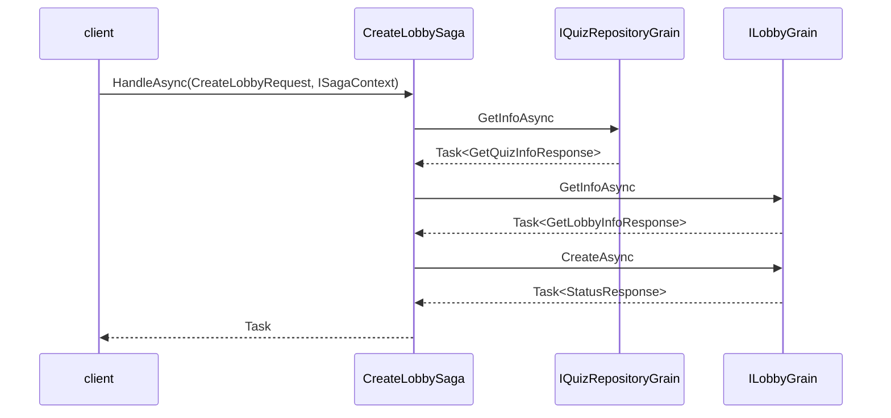
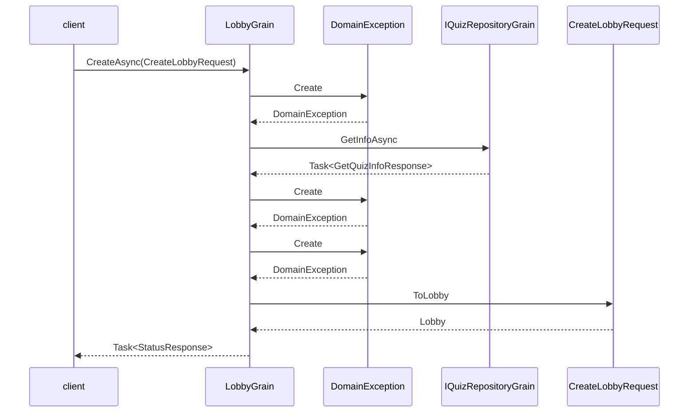
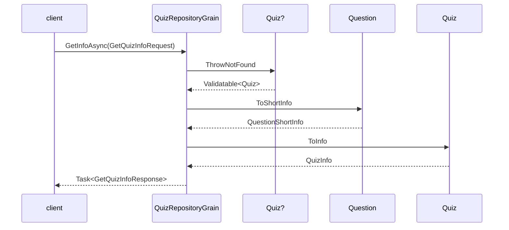
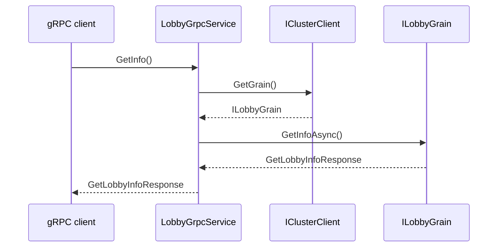
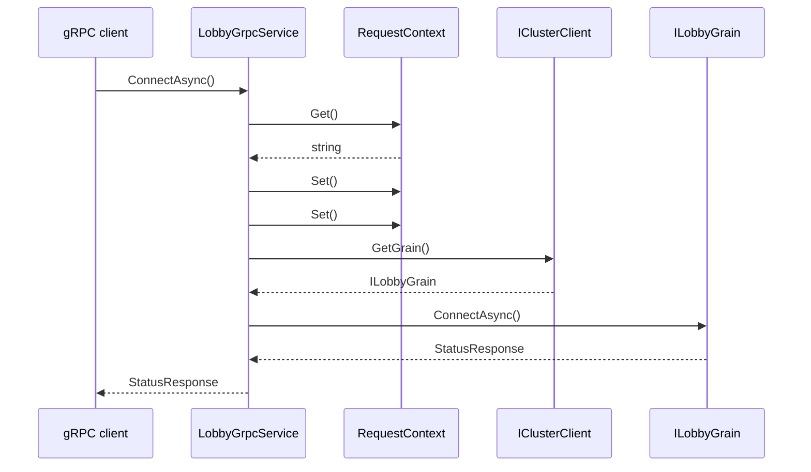
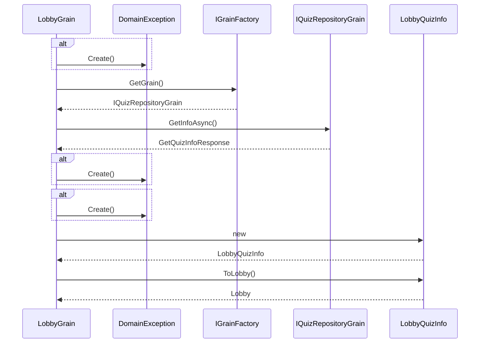
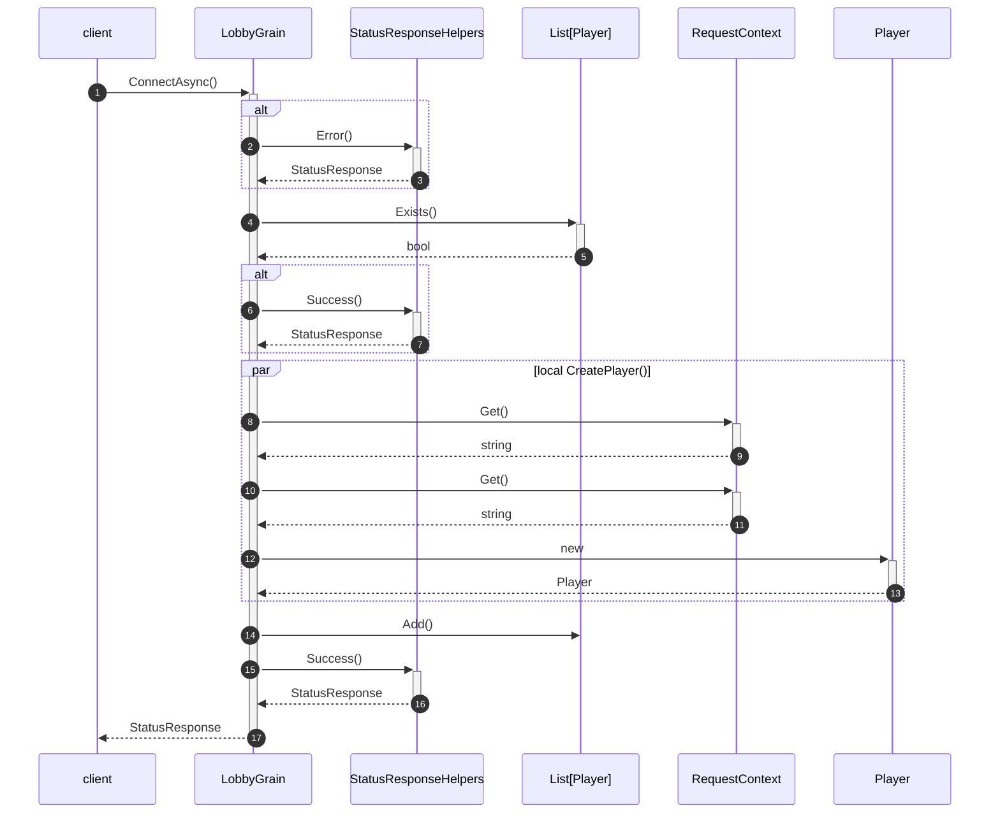

# CreateLobbySaga.HandleAsync Метод
## Определение
Пространство имен: EazyQuizy.Core.Grains.Saga.CreateLobbySagas

## Перегрузки
|||
|---|---|
|[HandleAsync(CreateLobbyRequest, ISagaContext)](#f73a04e9-ca56-44b3-aafd-6fe885358eaa)|Описание отсутствует|

## <a id=f73a04e9-ca56-44b3-aafd-6fe885358eaa></a> HandleAsync(CreateLobbyRequest, ISagaContext)
Исходный код: [HandleAsync(CreateLobbyRequest, ISagaContext)](https://github.com/Belzebbuz/EazyQuizy/blob/39d54cde57f90473b41ddaf4634a4aaf28031c5f//src/core/EazyQuizy.Core.Grains/Saga/CreateLobbySagas/CreateLobbySaga.cs#L11)

```csharp
public System.Threading.Tasks.Task HandleAsync(EazyQuizy.Common.Grpc.Lobby.CreateLobbyRequest message, EazyQuizy.Core.Grains.Saga.Abstractions.ISagaContext context)
```
### Параметры
`message` - `CreateLobbyRequest`

`context` - [ISagaContext](https://github.com/Belzebbuz/EazyQuizy/blob/39d54cde57f90473b41ddaf4634a4aaf28031c5f//src/core/EazyQuizy.Core.Grains/Saga/Abstractions/ISagaContext.cs#L5)

### Возвращаемое значение
`Task`

### Порядок вызова методов
[IQuizRepositoryGrain.GetInfoAsync](#iquizrepositorygrain) - [Исходный код](https://github.com/Belzebbuz/EazyQuizy/blob/39d54cde57f90473b41ddaf4634a4aaf28031c5f//src/core/EazyQuizy.Core.Grains/Saga/CreateLobbySagas/CreateLobbySaga.cs#L14)

[ILobbyGrain.GetInfoAsync](#ilobbygrain) - [Исходный код](https://github.com/Belzebbuz/EazyQuizy/blob/39d54cde57f90473b41ddaf4634a4aaf28031c5f//src/core/EazyQuizy.Core.Grains/Saga/CreateLobbySagas/CreateLobbySaga.cs#L15)

[ILobbyGrain.CreateAsync](#ilobbygrain) - [Исходный код](https://github.com/Belzebbuz/EazyQuizy/blob/39d54cde57f90473b41ddaf4634a4aaf28031c5f//src/core/EazyQuizy.Core.Grains/Saga/CreateLobbySagas/CreateLobbySaga.cs#L16)

### Диаграмма вызовов

# ILobbyGrain
## Определение
Пространство имен: EazyQuizy.Core.Abstractions.Grains.Lobby

Исходный код: [ILobbyGrain](https://github.com/Belzebbuz/EazyQuizy/blob/39d54cde57f90473b41ddaf4634a4aaf28031c5f//src/core/EazyQuizy.Core.Abstractions/Grains/Lobby/ILobbyGrain.cs#L7)

## Реализации
||||
|---|---|---|
|[LobbyGrain](#lobbygrain)|[GetInfoAsync()](#0eae7c45-36e7-4c84-9b60-308421d7553b)|Получает актуальную информацию о состоянии лобби|
|[LobbyGrain](#lobbygrain)|[CreateAsync(CreateLobbyRequest)](#d1dc7287-5560-4288-acb2-885537ad7295)||

# LobbyGrain
## <a id=0eae7c45-36e7-4c84-9b60-308421d7553b></a> GetInfoAsync()
Исходный код: [GetInfoAsync()](https://github.com/Belzebbuz/EazyQuizy/blob/39d54cde57f90473b41ddaf4634a4aaf28031c5f//src/core/EazyQuizy.Core.Grains/Lobbies/LobbyGrain.cs#L54)

Получает актуальную информацию о состоянии лобби

```csharp
public System.Threading.Tasks.Task<EazyQuizy.Common.Grpc.Lobby.GetLobbyInfoResponse> GetInfoAsync()
```
### Возвращаемое значение
`Task<GetLobbyInfoResponse>`

### Порядок вызова методов
## <a id=d1dc7287-5560-4288-acb2-885537ad7295></a> CreateAsync(CreateLobbyRequest)
Исходный код: [CreateAsync(CreateLobbyRequest)](https://github.com/Belzebbuz/EazyQuizy/blob/39d54cde57f90473b41ddaf4634a4aaf28031c5f//src/core/EazyQuizy.Core.Grains/Lobbies/LobbyGrain.cs#L29)

```csharp
public System.Threading.Tasks.Task<EazyQuizy.Common.Grpc.Types.StatusResponse> CreateAsync(EazyQuizy.Common.Grpc.Lobby.CreateLobbyRequest request)
```
### Параметры
`request` - `CreateLobbyRequest`

### Возвращаемое значение
`Task<StatusResponse>`

### Порядок вызова методов
[DomainException.Create](#domainexception) - [Исходный код](https://github.com/Belzebbuz/EazyQuizy/blob/39d54cde57f90473b41ddaf4634a4aaf28031c5f//src/core/EazyQuizy.Core.Grains/Lobbies/LobbyGrain.cs#L33)

[IQuizRepositoryGrain.GetInfoAsync](#iquizrepositorygrain) - [Исходный код](https://github.com/Belzebbuz/EazyQuizy/blob/39d54cde57f90473b41ddaf4634a4aaf28031c5f//src/core/EazyQuizy.Core.Grains/Lobbies/LobbyGrain.cs#L35)

[DomainException.Create](#domainexception) - [Исходный код](https://github.com/Belzebbuz/EazyQuizy/blob/39d54cde57f90473b41ddaf4634a4aaf28031c5f//src/core/EazyQuizy.Core.Grains/Lobbies/LobbyGrain.cs#L38)

[DomainException.Create](#domainexception) - [Исходный код](https://github.com/Belzebbuz/EazyQuizy/blob/39d54cde57f90473b41ddaf4634a4aaf28031c5f//src/core/EazyQuizy.Core.Grains/Lobbies/LobbyGrain.cs#L40)

### Диаграмма вызовов

# IQuizRepositoryGrain
## Определение
Пространство имен: EazyQuizy.Core.Abstractions.Grains.Quiz

Исходный код: [IQuizRepositoryGrain](https://github.com/Belzebbuz/EazyQuizy/blob/39d54cde57f90473b41ddaf4634a4aaf28031c5f//src/core/EazyQuizy.Core.Abstractions/Grains/Quiz/IQuizRepositoryGrain.cs#L7)

## Реализации
||||
|---|---|---|
|[QuizRepositoryGrain](#quizrepositorygrain)|[GetInfoAsync(GetQuizInfoRequest)](#4ac701c4-e954-4858-9d5e-5c5145517e14)||

# QuizRepositoryGrain
## <a id=4ac701c4-e954-4858-9d5e-5c5145517e14></a> GetInfoAsync(GetQuizInfoRequest)
Исходный код: [GetInfoAsync(GetQuizInfoRequest)](https://github.com/Belzebbuz/EazyQuizy/blob/39d54cde57f90473b41ddaf4634a4aaf28031c5f//src/core/EazyQuizy.Core.Grains/Quizzes/QuizRepositoryGrain.cs#L45)

```csharp
public System.Threading.Tasks.Task<EazyQuizy.Common.Grpc.Quiz.GetQuizInfoResponse> GetInfoAsync(EazyQuizy.Common.Grpc.Quiz.GetQuizInfoRequest request)
```
### Параметры
`request` - `GetQuizInfoRequest`

### Возвращаемое значение
`Task<GetQuizInfoResponse>`

### Диаграмма вызовов



# LobbyGrpcService

## GetInfo
* IClusterClient.GetGrain()
* [ILobbyGrain.GetInfoAsync()](#ilobbygraingetinfoasync)



## ConnectPlayer
* RequestContext.Get()
* RequestContext.Set()
* IClusterClient.GetGrain()
* [ILobbyGrain.ConnectAsync()](#ilobbygrainconnectAsync)


## ILobbyGrain.GetInfoAsync
Получает актуальную информацию о состоянии лобби <br/>
Возвращаемый тип `GetLobbyInfoResponse`

### Реализация LobbyGrain
* IGrainFactory.GetGrain()
* IQuizRepositoryGrain.GetInfoAsync()
* DomainException.Create()
* LobbyQuizInfo.ToLobby()


## ILobbyGrain.ConnectAsync
Возвращаемый тип `StatusResponse`
### Реализация LobbyGrain


## IQuizRepositoryGrain.GetInfoAsync(GetQuizInfoRequest)